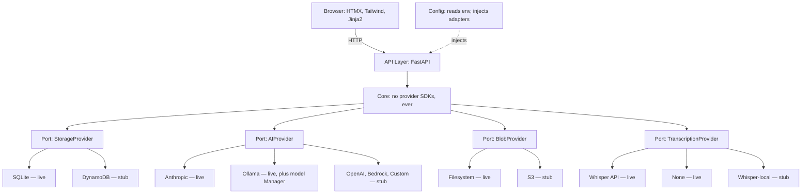

# REMI — Relationship Memory Intelligence

> **Summary**
> - Personal relationship intelligence tool. Voice memo or text in → structured memory out → pre-meeting briefs on demand.
> - **Deploy anywhere**: local Docker Compose (v1.0) or AWS cloud (v1.1).
> - **Hexagonal architecture**: core logic depends on abstract interfaces, never on cloud SDKs directly.
> - **Multi-provider AI**: Anthropic, Ollama, OpenAI, Bedrock, or custom HTTP endpoint — your choice via config.
> - **Secure by design**: encryption at rest, least-privilege auth, audit logging, documented threat model.

---

## What REMI Does

You log interactions with people through a chat-like interface — typed notes or voice memos. REMI extracts structured data: facts, interests, tags, open commitments. Later, you ask for a brief on someone before a meeting. REMI assembles their history into a useful summary.

**Two modes:**
- **Capture** — fast, low-friction. "Water cooler with Jerry, he likes Fall Out Boy." Done.
- **Recall** — rich, synthesized. "Brief me on Jerry, meeting Tuesday." Get back a useful summary with open loops flagged.

## Deployment Targets

| Target | Stack | Status |
|---|---|---|
| **Local (v1.0)** | Docker Compose, FastAPI, SQLite, filesystem storage, Anthropic/Ollama AI | **In progress** |
| **AWS Cloud (v1.1)** | Lambda + Mangum, DynamoDB, S3, CloudFront + WAF, KMS | Planned |

Both targets share the same FastAPI application code. Hexagonal architecture means adapters are swappable.

## Architecture

Core logic depends only on abstract **ports**. Concrete **adapters** plug in underneath — the only place a vendor SDK lives. Swap SQLite → DynamoDB or Anthropic → Ollama by changing config, never core.



**live = shipping in v1.0 · stub = planned for v1.1.** Full data-flow and deployment diagrams: [`docs/ARCHITECTURE.md`](docs/ARCHITECTURE.md).

## Quick Start (Local)

```bash
# 1. Clone and enter
git clone <your-repo> remi && cd remi

# 2. Copy env template, add your API keys
cp .env.example .env
# Edit .env: set ANTHROPIC_API_KEY, or AI_PROVIDER=ollama for local AI

# 3. Start services
docker compose up

# Already run Ollama on your host? Reuse its models instead of the bundled one:
# docker compose -f docker-compose.yml -f docker-compose.host-ollama.yml up

# 4. Open the UI
open http://localhost:8000
```

## Documentation

| File | Purpose |
|---|---|
| `docs/ARCHITECTURE.md` | System, data-flow, and deployment diagrams |
| `DECISIONS.md` | The 10 locked architectural decisions and rationale |
| `SECURITY.md` | Threat model, security controls per deployment |
| `DATA_MODEL.md` | Three tables, fields, query patterns, concrete examples |
| `BUILD_PLAN.md` | Phased build order for implementing v1.0 |

## Project Status

**v1.0 (local Docker) is functional.** Working end-to-end: capture (text or voice), AI extraction, person resolution, people management, on-demand briefs with history, date-based reminders, and local model management (pull/swap Ollama models from the UI). AWS cloud deployment (v1.1) is intentionally stubbed — see `DECISIONS.md`.

## License

Licensed under the **Apache License 2.0**. See [`LICENSE`](LICENSE).
