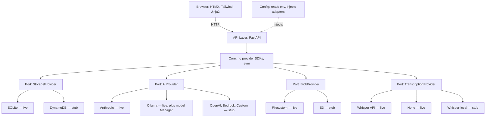
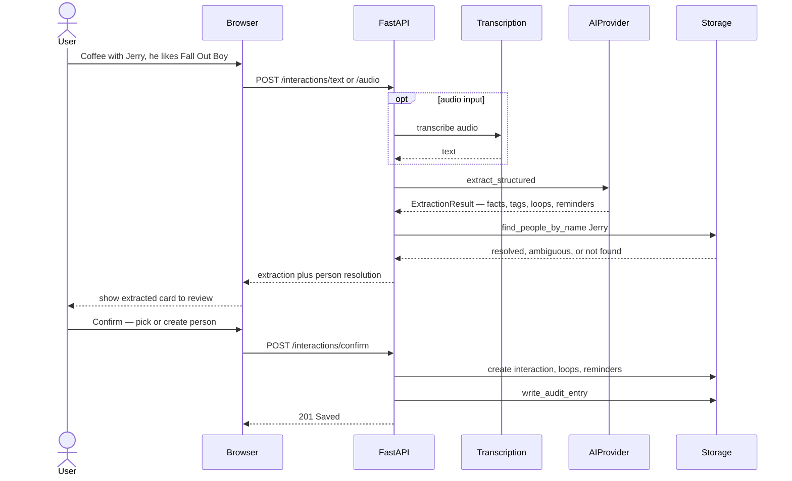
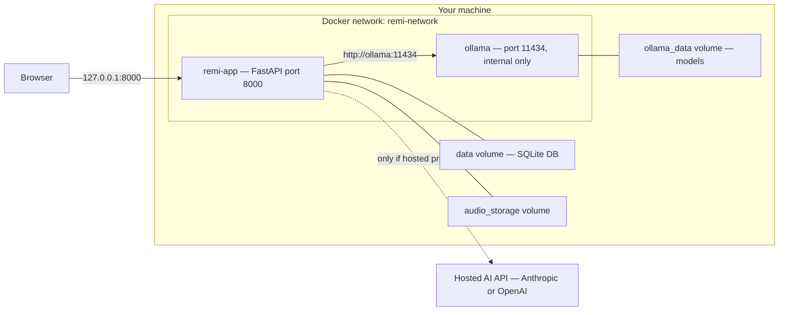

# Architecture

REMI uses a **hexagonal (ports & adapters)** design. The core business logic
depends only on abstract interfaces. Concrete implementations — databases, AI
providers, file storage — plug in underneath and are the *only* place a vendor
SDK is allowed. This is locked Decision #1 (see [`DECISIONS.md`](../DECISIONS.md)).

Three diagrams:
1. [System architecture](#1-system-architecture) — the layers and adapters
2. [Capture data flow](#2-capture-data-flow) — what happens when you log an interaction
3. [Local deployment](#3-local-deployment) — the Docker topology

Legend: **live** = shipping in v1.0 · **stub** = planned for v1.1 (`NotImplementedError`).

---

## 1. System architecture

Dependencies point **downward**. The core never reaches up into the API or out
to a provider SDK. Swap SQLite for DynamoDB, or Anthropic for Ollama, by changing
config — never core.

The four **ports** are abstract base classes in `adapters/*/base.py`. Each
concrete adapter implements one. `config/settings.py` is the only module that
reads environment variables — it builds the adapters and injects them at startup.

---

## 2. Capture data flow

Logging an interaction is a two-step flow: **extract, then confirm**. Extraction
is read-only — nothing is saved until you confirm — so you always review what the
AI pulled out before it lands in your data.

Recall (the brief) is the reverse: the API pulls a person's interactions, loops,
and reminders from storage and asks the `AIProvider` to synthesize a narrative
summary via `generate_text`.

---

## 3. Local deployment

`docker compose up` runs two containers on a private network. Only the app is
published to your machine; Ollama is internal-only. Data persists in three
bind-mounted volumes.

**Privacy note:** with `AI_PROVIDER=ollama`, no interaction text leaves your
machine — extraction and briefs run entirely in the local Ollama container. The
hosted-AI link is dotted because it's only used when you configure a hosted
provider.

The cloud target (v1.1) keeps the same architecture: API Gateway plus Lambda for
the API, DynamoDB for storage, S3 for blobs, CloudFront for the frontend. Those
adapters are stubbed today.
